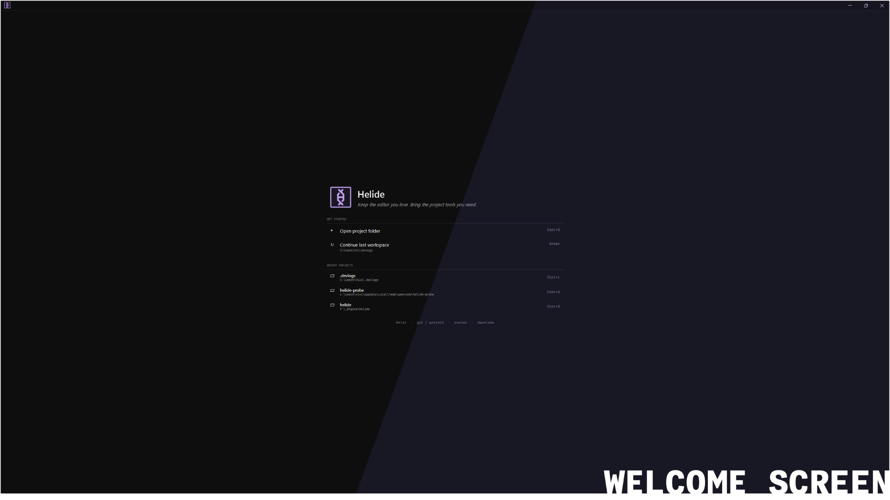
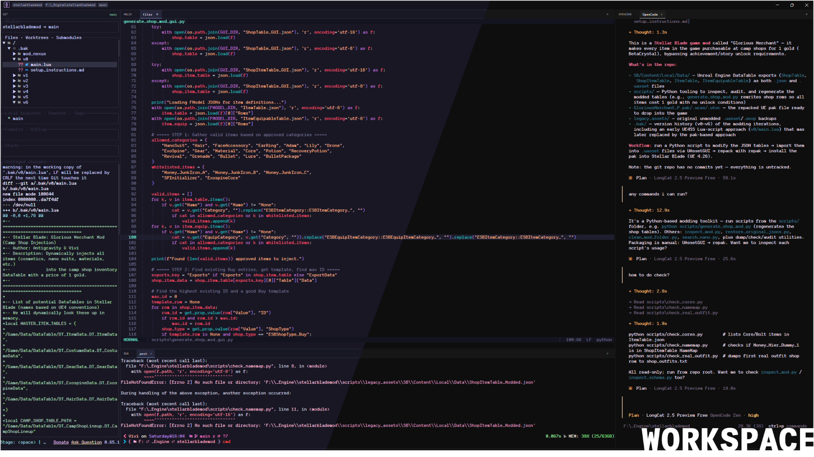
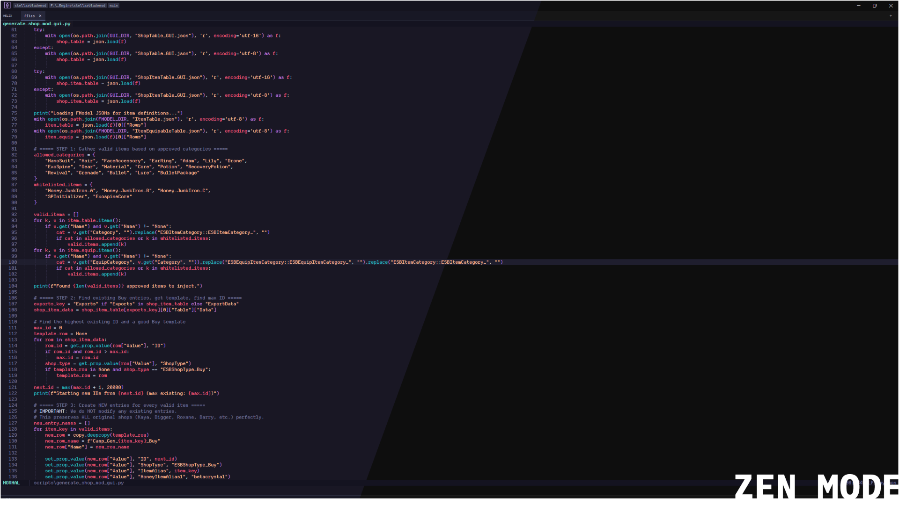
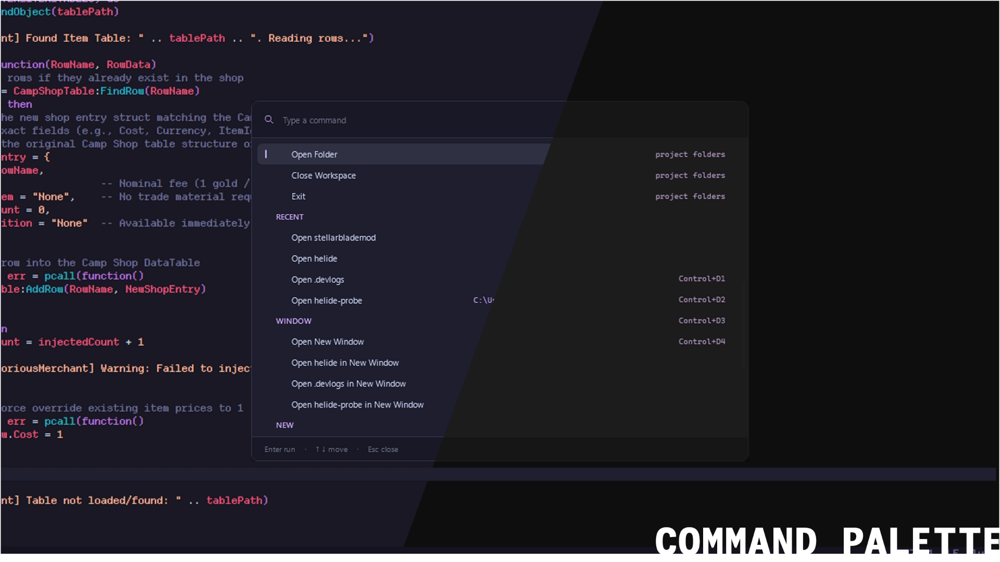
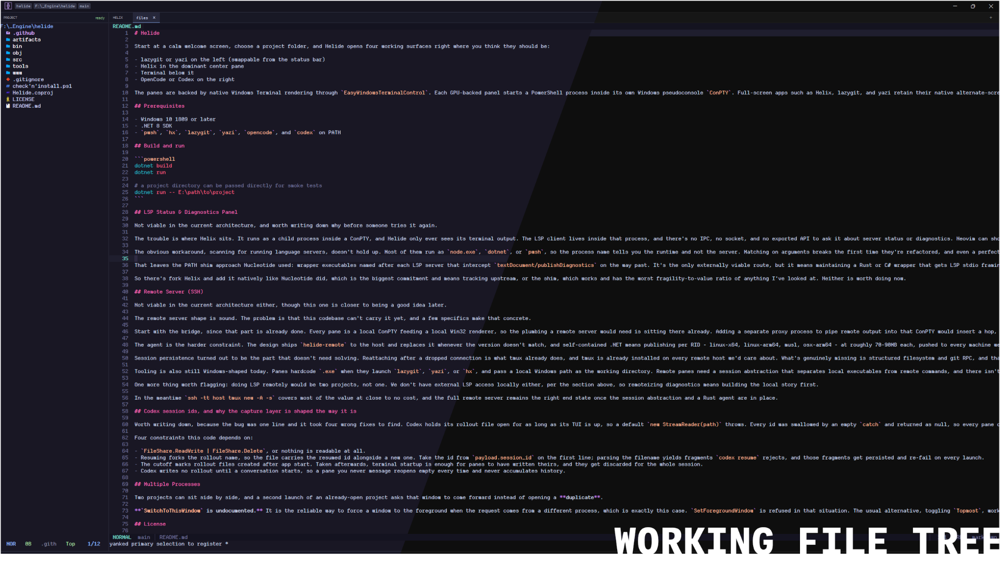

<!-- markdownlint-disable MD024 MD013 -->

# Helide



Start at a calm welcome screen, choose a project folder, and Helide opens a workspace familiar to home.

The workspace layout consists of:

- **Left Panel**
  - Project Browser via Yazi (`yazi`)
  - Git Control via LazyGit (`lazygit`)
- **Center Panel**
  - Code Editor via Helix (`hx`)
  - Shell Access via Terminal (`pwsh`)
- **Right Panel**
  - Agent support via Opencode (`opencode`)
  - Agent support via Codex (`codex`)



Each pane is its own process (`pwsh`, `hx`, `lazygit`, `yazi`, `opencode`, `codex`) running in its own Windows pseudoconsole through `ConPTY`, GPU-backed by `EasyWindowsTerminalControl`. Full-screen apps such as Helix, lazygit, and yazi retain their native alternate-screen semantics.

Download the release executable from the [Latest Release](https://github.com/ujjwalvivek/helide/releases/latest). Application Updates are automatic, or you can use the [AutoUpdater Utility](#autoupdater-utility).

Or, if you wish to build the binary yourself, see below.

## Prerequisites

- Windows 10 1809 or later
- .NET 8 SDK
- `pwsh`, `hx`, `lazygit`, `yazi`, `opencode`, and `codex` on PATH

Note: If you have tools missing on the PATH, see [CheckNInstall Utility](#checkninstall-utility)

## Build and run

```sh
# Debug build and run
dotnet build
dotnet run

# a project directory can be passed directly for smoke tests
dotnet run -- E:\path\to\project

# Release build
dotnet publish -c Release -r win-x64 --self-contained
```

## Repository Layout

```sh
helide/
├── src/
│   ├── App/              # Startup, instance guard, activation watcher
│   ├── Assets/           # Images (duplicated to www/images/)
│   ├── Config/           # Bundled yazi config + opener script (embedded)
│   ├── Interop/          # Win32 / P/Invoke helpers
│   ├── Persistence/      # AppState, WorkspaceState (JSON)
│   ├── Projects/         # Project loader / session manager
│   ├── Services/         # Update service
│   ├── Sessions/         # Agent session tracking
│   ├── Shell/            # Command palette, folder picker
│   ├── Terminal/         # Native terminal host (ConPTY)
│   └── Theme/            # Theme palette and XAML resources
├── tools/
│   ├── AutoUpdater/      # TUI updater CLI
│   └── CheckNInstall/    # Dependency checker / installer
├── www/                  # Static Helide site
└── README.md
```

## Tools and Utilities

### AutoUpdater Utility

TUI (terminal) CLI updater for Helide. Checks GitHub releases, downloads updates (zip or exe), installs beside Helide, and restarts.

Update source:

- `https://api.github.com/repos/ujjwalvivek/helide/releases/latest`
- Downloads `.zip` or `.exe` asset from GitHub releases
- Extracts `.exe` from zip, installs beside `Helide.exe`

#### Build and run

```sh
# Debug build
cd tools/AutoUpdater
dotnet build

# Run the binary (with flags)
dotnet run
dotnet run --check        # only check, don't install
dotnet run --silent       # suppress extra output

# Release build
dotnet publish -c Release -r win-x64 --self-contained
```

**Note**: This utility need not be ran to update Helide. The app automatically checks for new updates on restarts and highlights the new updates in the title bar and the about page of the app.

### CheckNInstall Utility

Interactive TUI that checks the CLIs Helide shells out to, installs what is missing, repairs PATH, publishes the single-file builds, and installs them. The user PATH is guarded at 2000 characters for safety.

#### Build and run

```sh
# Debug build
cd tools/CheckNInstall
dotnet build

# Run the binary (with flags)
dotnet run           # interactive menu
dotnet run --check   # report only, exit 0 when ready
dotnet run --full    # every phase, no prompts

# Release build
dotnet publish -c Release -r win-x64 --self-contained
```

#### Phases

It goes through 5 phases:

1. Checks if lazygit, hx, yazi, opencode, codex is on PATH
2. `winget install` each missing one
3. `WinGet\Links` can be empty, so `WinGet\Packages` is added to the user PATH
4. Builds with `-r win-x64 --self-contained`, into `bin\Release\net8.0-windows\*-win-x64.exe`
5. Finally, installs into `%LOCALAPPDATA%\Programs\Helide\`, and the user PATH.

**Note**: Installation also creates a Start Menu entry for `Helide.exe`, and also does a silent install of `AutoUpdater.exe` beside it.

## Configurations and Settings

Settings and configs are persisted under `%LOCALAPPDATA%\Helide`.

| File                   | Key / Setting      | Values                                          | Description                    |
| ---------------------- | ------------------ | ----------------------------------------------- | ------------------------------ |
| `state.json`           | `Theme`            | `"mocha"`, `"oled"`                             | Active color theme             |
| `state.json`           | `LastProjectPath`  | `string`                                        | Last opened project directory  |
| `state.json`           | `RecentProjects[]` | array                                           | Up to 8 recent projects        |
| `state-ws-{hash}.json` | `Window`           | `Left`, `Top`, `Width`, `Height`, `IsMaximized` | Window geometry                |
| `state-ws-{hash}.json` | `Layout`           | ratios + `LeftCollapsed`, etc.                  | Pane ratios and collapse state |
| `state-ws-{hash}.json` | `AgentSessions[]`  | `Type`, `Name`, `SessionId`                     | Agent tab state                |
| `state-ws-{hash}.json` | `EditorTabs[]`     | `Path`                                          | Open file paths                |
| `state-ws-{hash}.json` | `ActiveAgentIndex` | `int`                                           | Which agent tab was selected   |
| `state.json`           | `YaziOpenInHelide` | `bool`                                          | yazi config installed          |

Reset: delete the `.json` files. Per-project workspace files are named by a SHA-256 hash of the full project path (`state-ws-*.json`). `%LOCALAPPDATA%\Helide\open-request.txt` is deleted and recreated on every launch, so removing it by hand changes nothing.

## Features

### Familiar Workspace

Every pane, left pane (`lazygit` & `yazi`), bottom runner terminal (`pwsh`), and right agents pane (`opencode` & `codex`), can be expanded or collapsed independently. This leaves you with a zen-mode like center editor (`hx`), for an uninterrupted workflow. Collapse state is part of the persisted workspace file (`state-ws-{hash}.json`), so closing and reopening a project restores the exact same panel visibility. The layout ratios and collapse flags are persisted.



Editor buffers, agents, and terminal runners all share the same tabbed surface model. New files open directly from the working file tree or from the command palette. Agents get tabbed support for multi agentic sessions, and the session state is persisted per project in `state-ws-*.json`. Multiple terminal tabs to run various commands at once. `CTRL+P` will bring up a command palette that works across panels cohesively, keyboard-driven fuzzy command runner.



### Persisted Layout

The layout engine (`WorkspaceLayoutState`) divides the window into ratios, and each surface can be expanded or collapsed independently without losing its contents. Layout is saved across restarts per project in a file named by a SHA-256 hash of the full project path (`state-ws-{hash}.json` under `%LOCALAPPDATA%\Helide\`). The file includes window geometry, pane ratios and collapse flags, open editor tabs, active agent index, and agent sessions.

### Working File Tree



Project browser via `yazi` that helps navigates, selects, and opens files directly in the Helix editor. See [Yazi Configuration](#yazi-configuration).

**TLDR;** The pane runs the real `yazi.exe` in its own ConPTY, so the tree is yazi itself rather than a reimplementation. Selection is handed to Helide through yazi's own `[opener]` rules: a script appends the chosen path to `open-request.txt`, which Helide watches and drains by byte offset into an editor tab. Each new file opens in its own tab in the center panel, and the open tabs are persisted per project (`EditorTabState.Path`).

## Yazi Configuration

Out of the box yazi opens files with whatever Windows picks, which spawns stray windows outside Helide. Opening it inside Helide will need a bit of tweaking.

Helide offers to install its own yazi config. While it is missing, the project browser shows an offer card (`YaziPromptCard`) instead of the file tree, and yazi itself is not started until you answer. The offer comes back whenever you open the project browser, until the config is in place.

Accepting this will install four files in your Yazi's config directory at `%APPDATA%\yazi\config\` and restarts the app. Declining it will open Yazi with your/default config. Nothing is installed. The same install is available any time from the command palette as **Open Project Browser Files in Helide** (View).

| File                   | What it does                                                                    |
| ---------------------- | ------------------------------------------------------------------------------  |
| `yazi.toml`            | Sidebar layout (`ratio = [0, 1, 0]`), sorting, mouse, and the `[opener]` rules  |
| `keymap.toml`          | `g d`, `g o`, `S`, `H`, `L`, `O`, `h`/`l` and arrow/`BS` movement for a sidebar |
| `theme.toml`           | Helide's own palette so yazi does not read as a foreign app in the pane         |
| `open-with-helix.ps1`  | The script the openers call. Also the marker file for "installed"               |

Anything inside that folder is backed up to `%APPDATA%\yazi\config\helide-backup-<yyyyMMdd-HHmmss>\`, so accepting the offer costs nothing that cannot be undone. Restore by deleting the four installed files and moving the backup contents back. Deleting `open-with-helix.ps1` (or restoring a backup) makes Helide offer again.

### How a file reaches the editor

1. Yazi's `[opener]` entries (both `edit` and `open`) run `open-with-helix.ps1 %s`.
2. The script appends the path to the file named by `HELIDE_OPEN_REQUEST`, an environment variable Helide exports to the processes it launches. That file is `%LOCALAPPDATA%\Helide\open-request.txt`.
3. Helide watches it with a `FileSystemWatcher` and consumes it by byte offset, so two writes cannot be read as one half-line.
4. Each drained path opens in a tab in the center editor pane.

### Details worth knowing

- `%s` is deliberately unquoted in `yazi.toml`. Yazi quotes substituted paths itself, and a second layer turns one path into two arguments that do not exist.
- There is no wildcard `[open]` rule on purpose. A `{ url = "*" }` rule captures directories too, and a directory matching an opener is handed to the opener instead of being descended into -- folders stop expanding.
- The text/binary call is made per file by the script, not by an extension list. Helix renders text, so a NUL byte in the first 8KB sends the file to `Start-Process` and lets Windows pick a handler.
- A directory reaching the script is handed back to yazi via `ya emit cd`.
- `orphan = true` and no `block`: yazi does not drop to the alternate screen on every open, and nothing waits on PowerShell startup.
- Standalone yazi with no Helide running just calls `hx` directly, so the config is harmless outside Helide.

**Note**: This is still not a foolproof solution, there might be a slip in opening a file here or a directory there. If that happens, please raise an issue.

## FAQs

### Why WPF?

Helide uses C# for its development. I wanted to use Helix in a way that fgeels familiar to me, and on Windows. I wanted something native, and C# IS kinda *native* to Windows.

### Does Helide have a remote server for remote development?

Not viable in the current architecture, the problem being that this codebase can't carry it yet. Though this one is closer to being a good idea later.

So answer is No. If you wish to know more, read below.

Every pane is a local ConPTY feeding a local Win32 renderer. Adding a separate proxy process to pipe remote output into that ConPTY would insert a hop, a resize relay, and a new way for panes to fail. Which is fine, and solvable through multiple iterations.

Much harder constraint is the remote agent. The design should ship `helide-remote` binary to the host and replaces it whenever the version doesn't match, and self-contained .NET means publishing per RID - linux-x64, linux-arm64, musl, osx-arm64 - at roughly 70-90MB each, pushed to every machine we connect to. Which obviosuly sounds like a bad idea. On the contrary, Rust cross-compiled to static musl is 3-10MB per architecture. At that size difference the deployment is too tempting not to try, but that would need an architectural rewrite.

Tooling is also still Windows-shaped today. Panes hardcode `.exe` when they launch `lazygit`, `yazi`, or `hx`, and pass a local Windows path as the working directory. Remote panes need a session abstraction that separates local executables from remote commands, and there isn't one yet. That abstraction has to come first regardless of which direction this goes.

In the meantime `ssh -tt host tmux new -A -s` covers most of the value at close to no cost, and the full remote server remains the right end state once the session abstraction and a Rust agent are in place. One more thing worth flagging: doing LSP remotely would be two projects. We don't have external LSP access locally either, per the section above, so remoteizing diagnostics means building the local story first.

## Does Helide have a Diagnostics Panel?

Again, Not viable in the current architecture, so no.

If you wish to know more, read below.

The trouble is where Helix sits. It runs as a child process inside a ConPTY, and Helide only ever sees its terminal output. The LSP client lives inside that process, and there's no IPC, no socket, and no exported API to ask it about server status or diagnostics. Neovim can show `:LspInfo` because its client is also inside the process, which is where the information lives.

The obvious workaround, scanning for running language servers, doesn't hold up. Most of their process name tells you the runtime and not the server they're running. So matching names break, and even a perfect match says nothing about their state (starting, ready, and failed). Helix does log LSP events under `%LOCALAPPDATA%\helix\`, but the format isn't stable or documented, so parsing it is guesswork, and there are no structured diagnostic events to hook into regardless.

That leaves the PATH shim approach [Nucleotide](https://github.com/iainh/nucleotide) used: wrapper executables named after each LSP server that intercept `textDocument/publishDiagnostics` on the way past. It's the only externally viable route, but it means maintaining a Rust or C# wrapper that gets LSP stdio framing right for every server we care about. High maintenance, very very brittle, and has the worst fragility-to-value ratio of anything I've looked at.

## Acknowledgements

- [Helix](https://helix-editor.com/): modal editor
- [lazygit](https://github.com/jesseduffield/lazygit): git UI
- [yazi](https://yazi-rs.github.io/): terminal file manager
- [Opencode](https://github.com/anomalyco/opencode): agent workspace
- [Codex](https://openai.com/index/introducing-codex/): agent assistant
- [EasyWindowsTerminalControl](https://github.com/claytonbd/EasyWindowsTerminalControl): ConPTY WPF control

## License

Helide is released under the MIT License. See [LICENSE](LICENSE).
